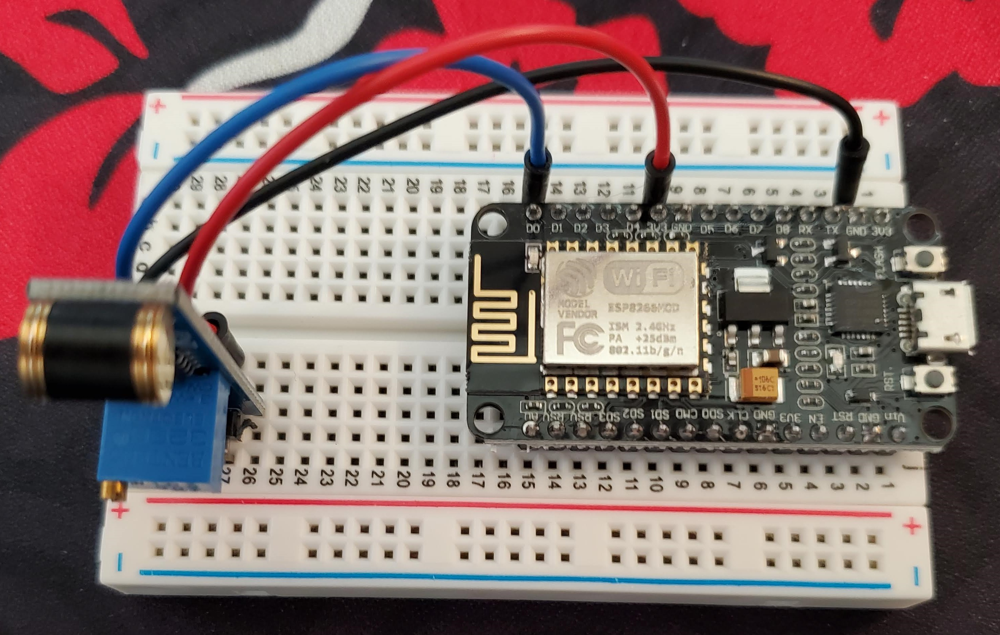

# ESP8266 Arduino Appliance Monitor

This project provides code and hardware examples for configuring an appliance monitoring IoT device. This project was inspired by [Shmoopty/rpi-appliance-monitor](https://github.com/Shmoopty/rpi-appliance-monitor). Instead of using a raspberry pi, it uses an inexpensive ESP8266 development board. All the parts for this project cost less than $20 USD.

I built this to use on my washer and dryer since they have very loud and annoying buzzers.

## Parts

- [ESP8266 Development Board](https://smile.amazon.com/dp/B081CSJV2V?ref=ppx_yo2ov_dt_b_product_details&th=1)
- [801S Vibration Sensor](https://smile.amazon.com/dp/B00M1PN7PW?psc=1&ref=ppx_yo2ov_dt_b_product_details)
- A small breadboard and jumper wires

Connect the 3.3v and GRD pins to the + and - headers respectively. The digital pin from the sensor should be on D0.

## Prerequisites

- An account at [PushingBox](https://www.pushingbox.com/index.php) for managing notifications.
  - Set up a new scenario with the services you want to interface with. Make note of the scenario's device ID.
- Install the Silicon Labs USB to UART drivers from [here](https://www.silabs.com/developers/usb-to-uart-bridge-vcp-drivers).
- [Arduino IDE](https://www.arduino.cc/en/software) installed
  - Go to File->Preferences and copy the URL below to get the ESP board manager extensions: http://arduino.esp8266.com/stable/package_esp8266com_index.json
  - Restart the Arduino IDE
  - Plug the board into your computer with a USB cable
  - Go to Tools > Board > Board Manager> Type "esp8266" and download the Community esp8266 and install.
  - Set up your chip:
    - Tools -> Board -> NodeMCU 1.0 (ESP-12E Module)
    - Tools -> Flash Size -> 4M (3M SPIFFS)
    - Tools -> CPU Frequency -> 80 Mhz
    - Tools -> Upload Speed -> 921600
    - Tools -> Port -> (choose your port here, mine was COM4)
  - Test your board by loading the Blink example
    - File -> Examples -> ESP8266 -> Blink
    - Upload

## Building

- Open `monitor/monitor.ino` in the Arduino IDE.
- Configure the variables located inside the `User Configurables` section of the program.
- Click Upload

Test the board by waiting for the LED to stop blinking and giving it a shake. You can see debug output by clicking Tools->Serial Monitor. Set the baud rate to 115200.

If the sensor is too sensitive, you can turn the small dial on the sensor clockwise to reduce sensitivity.

## Usage

When the board starts, it will enter a grace period mode to allow the user to start the appliance without accidentally triggering the alert. The LED will flash until the grace period is completed.

Once the board detects vibrations, it will begin a countdown defined by `ALERTTHRESHOLD`. Once it does not detect any vibrations for for this many milliseconds, it will send the alert.

After the alert is sent, the LED will be in a solid on state. It will not send an alert again until it is reset. It is recommended to simply press the RST button on the board after you start the appliance.

## TODO

- Shut down the board when finished.
- Integrate directly with notification services rather than a proxy